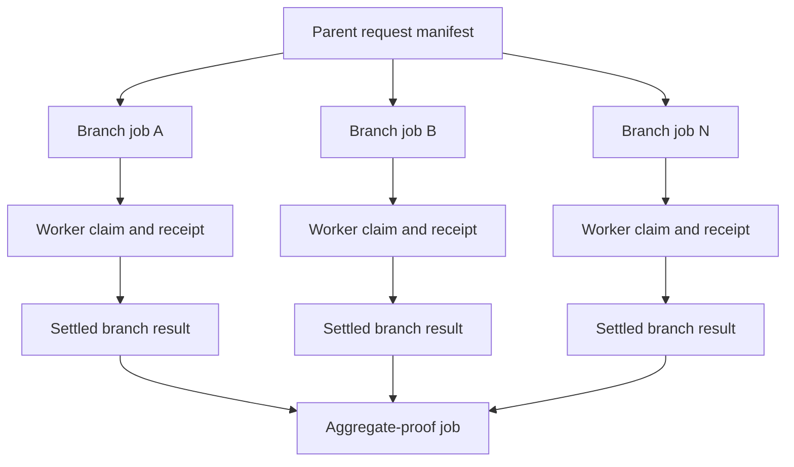
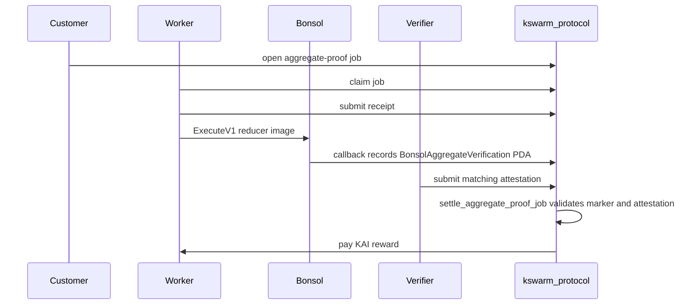

# Architecture Overview

kswarm separates customer-facing work into branch jobs and aggregate jobs. Solana owns escrow, stake, claim rights, settlement, cancellation, and slashing. IPFS and worker software move artifacts; they do not decide payments.

## Payment Token

Escrow, rewards, and stake use one SPL mint, KAI (classic SPL Token, 6 decimals) on mainnet, and a stand-in mint with the same layout on devnet and localnet. `ProtocolConfig` pins the mint, its token program, its decimals, and the four stake floors at `initialize_protocol`. See [KAI Payment Token](kai-payment-token.md).

## Job Model

## Aggregate Settlement Gate

The generic `settle_job` instruction rejects `aggregate-proof` jobs. Aggregate payment must pass through `settle_aggregate_proof_job`, which checks the marker PDA, image id, input digest, output digest, journal hash, and verifier attestation.

The Bonsol callback reaches the program only through the raw `fallback` instruction (tag byte `1`, five 32-byte commitments, then the forwarded input digest and committed outputs). There is no Anchor-dispatched `record_aggregate_verification`; that variant was unreachable and was removed in PR-3.

`open_job` accepts an `aggregate-proof` job only with the Bonsol aggregate capability hash, and accepts that capability hash only on an `aggregate-proof` job. The marker gate needs both, so a job with one of them could never settle.

## Challenge Authorization

A challenge can slash a worker, so it is not permissionless. `challenge_job` accepts only the verifier that the customer or the protocol admin assigned to the job with `assign_verifier`. This holds for every job class. A worker can never challenge its own job. Any verifier with the floor stake may still post an attestation, but an attestation moves no funds by itself: on a non-aggregate job it does not block `settle_job`, and on an aggregate job settlement needs a matching attestation plus the Bonsol marker.

This is the H2-Interim rule from the [remediation spec](protocol-security-remediation-spec.md). The bonded dispute path (H2-Full) is a separate milestone.

## Lifecycle Escapes

Every job reaches one terminal state. The escapes below stop escrow or stake from being locked forever.

| Situation | Instruction | Who calls | Escrow | Worker stake |
| --- | --- | --- | --- | --- |
| Job never claimed | `cancel_open_job` | customer | refunded | not involved |
| Claimed, no receipt before `execute_deadline` | `slash_stale_job` | anyone | refunded | `required_stake` paid to the customer |
| Completed, attestation mismatch | `challenge_job` + three claims | assigned verifier, then anyone | refunded | `min(required_stake, challenge_bond)` to the verifier, the rest to the customer |
| Completed non-aggregate, challenge window closed | `settle_job` | anyone | paid to the worker | unlocked |
| Completed aggregate, marker and matching attestation | `settle_aggregate_proof_job` | anyone | paid to the worker | unlocked |
| Completed aggregate, registry exhausted, no attestation | `cancel_aggregate_proof_job` | customer | refunded | unlocked, no slash |
| Completed aggregate, 24 h after the challenge window closed and still not settled | `cancel_aggregate_proof_job` | customer | refunded | unlocked, no slash |

`slash_stale_job` sets every settlement flag, so the three claim instructions reject the job afterwards (`SlashAlreadySettled`). The 24 h grace period is `AGGREGATE_MARKER_TIMEOUT_SECONDS`. The program cannot see whether a marker exists (the marker PDA is keyed by an off-chain execution id), so the rule is time based: settlement first becomes possible at `challenge_deadline`, and the worker or any watcher has the whole grace period to settle. The result is status `cancelled-on-timeout`.

## Protocol Initialization

`initialize_protocol` runs once and names the admin. Only the program's upgrade authority may call it. The instruction takes the program account and its `ProgramData` account; the program checks that `ProgramData` belongs to the program and that its upgrade authority signed as `admin`. A program deployed without the upgradeable loader, or made immutable before initialization, cannot be initialized. Deploy with `solana program deploy` (or `anchor deploy`) and initialize with the same authority keypair.

## Runtime

The Python stack does the paid work and ships as four container images built from `docker/swarm/Dockerfile`: `branch-worker` (claims and executes branch-proof jobs with the LLM), `verifier-worker` (re-executes and attests, challenges a mismatch), `aggregator-runner` (combines a run's branches and submits the aggregate receipt), and `cli` (operator commands, including `swarm bootstrap` and `predict`). `docker-compose.swarm.yml` runs them with a digest-pinned local validator and Kubo (`local` profile) or against an external RPC and mint (`devnet` profile). Every image is non-root, holds no key or endpoint, and reads its wallet from a mounted file. See [Containers](containers.md).

The Node stack is reduced to a control plane in `docker-compose.protocol.yml`: the artifact gateway (`protocol-api`) and the settlement watcher (`protocol-watcher`). The Node worker and verifier are retired ([Foundation Prototype](protocol-foundation-prototype.md)). The Python stack has no settle daemon yet: branch jobs settle through `kswarm settle` or the Node watcher.
