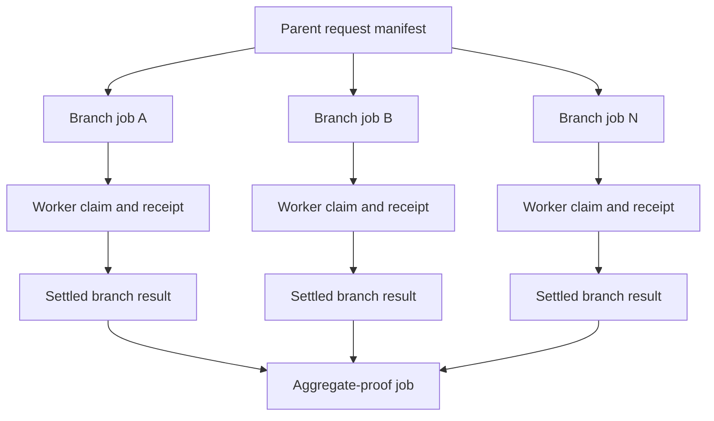
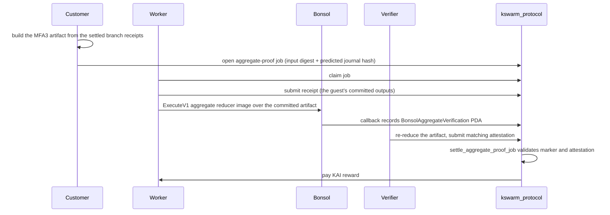

# Architecture Overview

kswarm separates customer-facing work into branch jobs and aggregate jobs. Solana owns escrow, stake, claim rights, settlement, cancellation, and slashing. IPFS and worker software move artifacts; they do not decide payments.

## Payment Token

Escrow, rewards, and stake use one SPL mint, KAI (classic SPL Token, 6 decimals) on mainnet, and a stand-in mint with the same layout on devnet and localnet. `ProtocolConfig` pins the mint, its token program, its decimals, and the four stake floors at `initialize_protocol`. See [KAI Payment Token](kai-payment-token.md).

## Job Model

## Aggregate Settlement Gate

The aggregate job is opened **after** its branches settle, by `kswarm predict bind-aggregate`, not by `predict open`. `open_job` fixes `input_bundle_hash` and `expected_result_hash` for good, and both are functions of the branch receipts, which do not exist until the branches run. Opening it earlier funds a job no Bonsol marker can ever match.

What the aggregate proof asserts is a recomputation, not an echo. The guest reads the artifact's branch receipt bytes, rehashes each one, decodes the branch values out of those bytes, applies the named combiner with its committed parameters, and commits `combiner_id`, a digest of the parameters, the result value, the branch count, and a Merkle root over the branch hashes. Those hashes are the `submitted_result_hash` values the program already stores for the branch jobs, so anyone can check which branches were reduced. Layouts are in [Proof Layer Status](proof-layer-status.md).

The generic `settle_job` instruction rejects `aggregate-proof` jobs. Aggregate payment must pass through `settle_aggregate_proof_job`, which checks the marker PDA, image id, input digest, output digest, journal hash, and verifier attestation.

The Bonsol callback reaches the program only through the raw `fallback` instruction (tag byte `1`, five 32-byte commitments, then the forwarded input digest and committed outputs). There is no Anchor-dispatched `record_aggregate_verification`; that variant was unreachable and was removed in PR-3.

`open_job` accepts an `aggregate-proof` job only with the Bonsol aggregate capability hash, and accepts that capability hash only on an `aggregate-proof` job. The marker gate needs both, so a job with one of them could never settle.

## What Is Proven, And What Is Not

Two things carry a zero-knowledge proof, and the language model step is not one of them.

**Proven, gated on chain.** The aggregate reduction. A Bonsol node proves the reducer
guest ran over the committed artifact, the Solana program records the marker, and
`settle_aggregate_proof_job` refuses to pay without it.

**Proven, verified off chain.** The branch canonicalization receipt. A branch worker
proves that the output document it published encodes to exactly the receipt whose hash
the chain accepted, and the verifier checks that proof before it attests. It is not an
on-chain gate, and nothing downstream turns it into one. `settle_job` pays a `Completed`
branch at its challenge deadline without reading an attestation or a receipt
(`solana/programs/kswarm_protocol/src/lib.rs:563-609`), the aggregate guest is handed
branch receipt bytes and no branch attestation, and `settle_aggregate_proof_job` checks
the aggregate job's own attestation and marker, not the branches'. What the receipt does
buy is real: a disagreeing attestation is challengeable and slashable inside the window.
The branch-level guarantee is therefore economic and social rather than enforced by the
chain; the aggregate-level one is enforced. See [Proof Layer Status](proof-layer-status.md),
"What the chain enforces about a branch", for the full position and the open item.

**Not proven: the branch language model step.** No zero-knowledge proof says a language
model produced a particular forecast from a particular prompt, and no 2026 technology can
produce one for a model this size. The largest language model anyone can prove with
released code is GPT-2 small at 124M parameters, the fastest published figure for it is
at a 16-token sequence, and kswarm's branch model is roughly 25 times larger. Every
prover that can reach even that size is licensed for evaluation only and tied to the
vendor's own proving network, so none of them could be shipped in a worker image in any
case. That step is secured **economically**: a verifier re-executes the branch with the
identical model, seed and configuration, and a worker whose receipt disagrees is
challenged and slashed. That guarantee rests on determinism measured on one model and one
prompt family; see [LLM Bridge Honest Limits](llm-bridge-honest-limits.md). Layouts and
the full position are in [Proof Layer Status](proof-layer-status.md).

## Challenge Authorization

A challenge can slash a worker, so it is not permissionless. `challenge_job` accepts only the verifier that the customer or the protocol admin assigned to the job with `assign_verifier`. This holds for every job class. A worker can never challenge its own job. Any verifier with the floor stake may still post an attestation, but an attestation moves no funds by itself: on a non-aggregate job it does not block `settle_job`, and on an aggregate job settlement needs a matching attestation plus the Bonsol marker.

This is the H2-Interim rule from the [remediation spec](protocol-security-remediation-spec.md). The bonded dispute path (H2-Full) is a separate milestone.

## Lifecycle Escapes

Every job reaches one terminal state. The escapes below stop escrow or stake from being locked forever.

| Situation | Instruction | Who calls | Escrow | Worker stake |
| --- | --- | --- | --- | --- |
| Job never claimed | `cancel_open_job` | customer | refunded | not involved |
| Claimed, no receipt before `execute_deadline` | `slash_stale_job` | anyone | refunded | `required_stake` paid to the customer |
| Completed, attestation mismatch | `challenge_job` + three claims | assigned verifier, then anyone | refunded | `min(required_stake, challenge_bond)` to the verifier, the rest to the customer |
| Completed non-aggregate, challenge window closed | `settle_job` | anyone | paid to the worker | unlocked |
| Completed aggregate, marker and matching attestation | `settle_aggregate_proof_job` | anyone | paid to the worker | unlocked |
| Completed aggregate, registry exhausted, no attestation | `cancel_aggregate_proof_job` | customer | refunded | unlocked, no slash |
| Completed aggregate, 24 h after the challenge window closed and still not settled | `cancel_aggregate_proof_job` | customer | refunded | unlocked, no slash |

`slash_stale_job` sets every settlement flag, so the three claim instructions reject the job afterwards (`SlashAlreadySettled`). The 24 h grace period is `AGGREGATE_MARKER_TIMEOUT_SECONDS`. The program cannot see whether a marker exists (the marker PDA is keyed by an off-chain execution id), so the rule is time based: settlement first becomes possible at `challenge_deadline`, and the worker or any watcher has the whole grace period to settle. The result is status `cancelled-on-timeout`.

## Protocol Initialization

`initialize_protocol` runs once and names the admin. Only the program's upgrade authority may call it. The instruction takes the program account and its `ProgramData` account; the program checks that `ProgramData` belongs to the program and that its upgrade authority signed as `admin`. A program deployed without the upgradeable loader, or made immutable before initialization, cannot be initialized. Deploy with `solana program deploy` (or `anchor deploy`) and initialize with the same authority keypair.

## Runtime

The Python stack does the paid work and ships as four container images built from `docker/swarm/Dockerfile`: `branch-worker` (claims and executes branch-proof jobs with the LLM), `verifier-worker` (re-executes and attests, challenges a mismatch), `aggregator-runner` (combines a run's branches and submits the aggregate receipt), and `cli` (operator commands, including `swarm bootstrap` and `predict`). `docker-compose.swarm.yml` runs them with a digest-pinned local validator and Kubo (`local` profile) or against an external RPC and mint (`devnet` profile). Every image is non-root, holds no key or endpoint, and reads its wallet from a mounted file. See [Containers](containers.md).

The Node stack is reduced to a control plane in `docker-compose.protocol.yml`: the artifact gateway (`protocol-api`) and the settlement watcher (`protocol-watcher`). The Node worker and verifier are retired ([Foundation Prototype](protocol-foundation-prototype.md)). The Python stack has no settle daemon yet: branch jobs settle through `kswarm settle` or the Node watcher.
